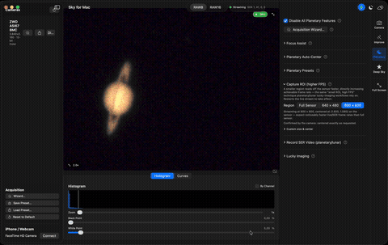
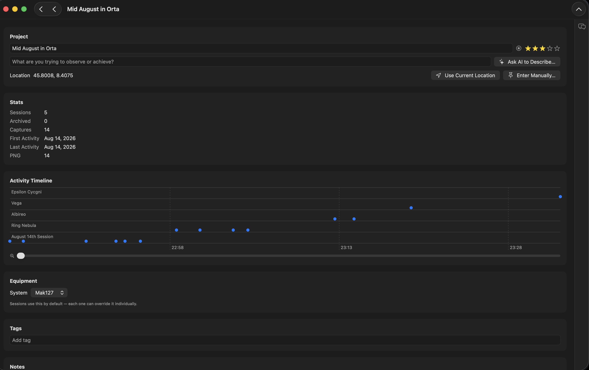
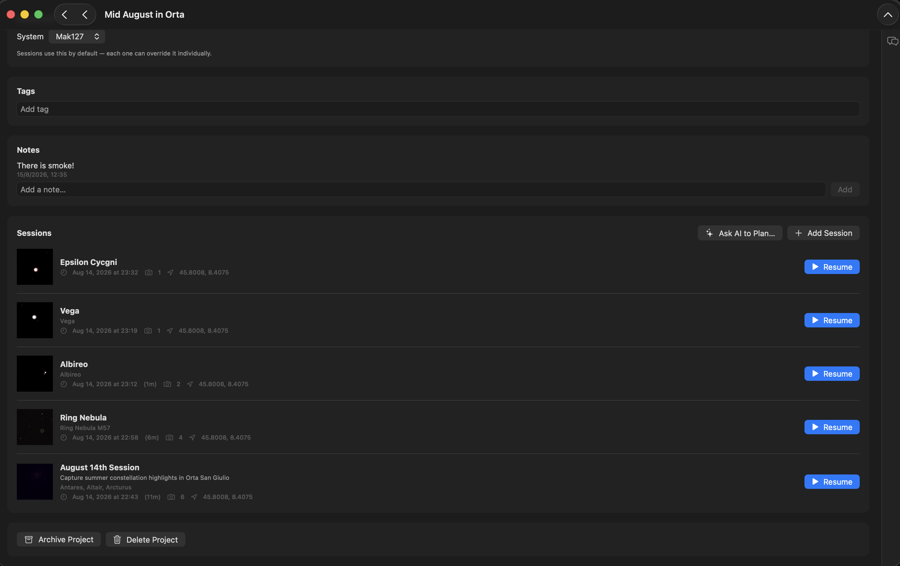
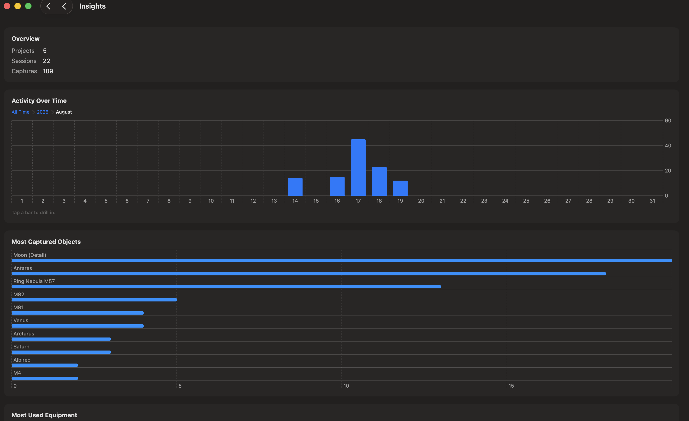
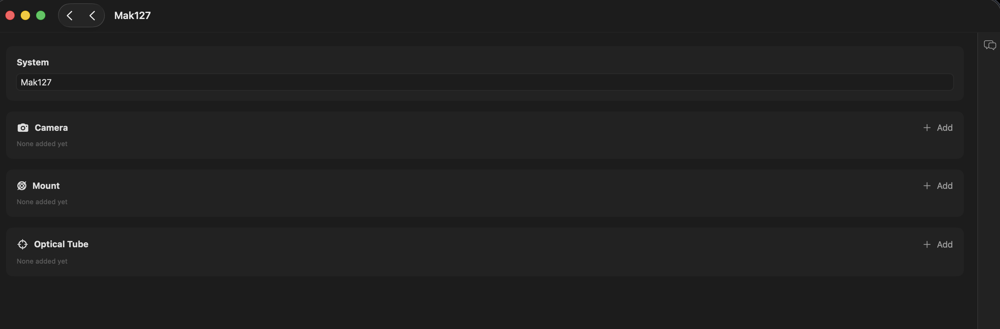
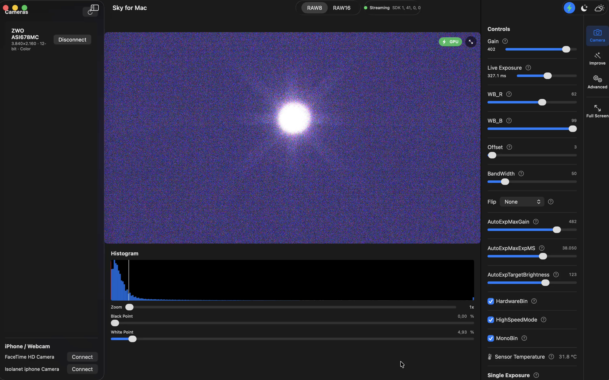
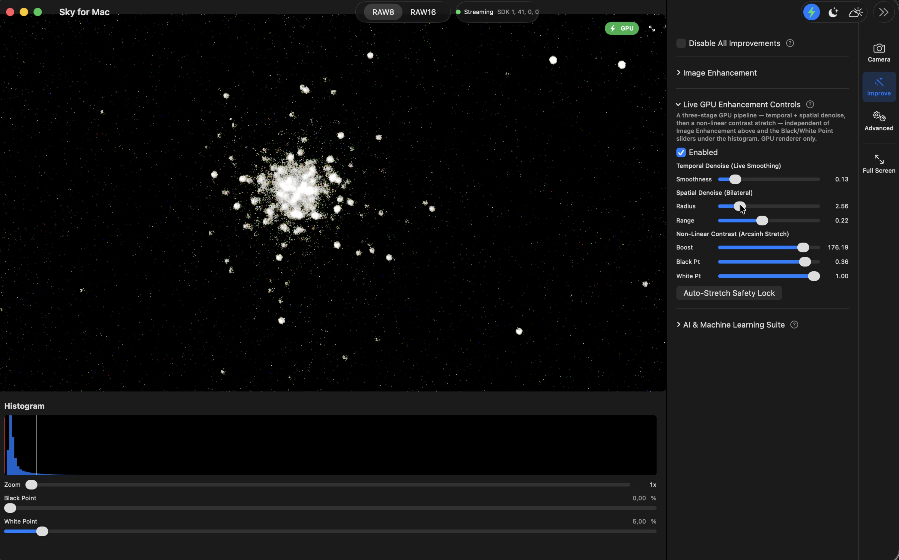

[](https://github.com/giulioroggero/skyformac/actions/workflows/ci.yml)
[](#requirements)
[](https://swift.org)
[](LICENSE.md)
[](https://github.com/giulioroggero/skyformac/releases)

<h1 align="center">Sky For Mac</h1>

> **Status: still in active development.** No official release has been published yet.
> Contributions are very welcome — testing against real cameras/mounts, feature proposals, code,
> bug reports, anything. If you have ZWO (or other) camera or astro gear you'd be willing to lend
> or send to the author for compatibility testing, that's especially appreciated — please reach
> out via [Issues](https://github.com/giulioroggero/skyformac/issues).

<p align="center">
  <a href="https://giulioroggero.github.io/skyformac-website/">Website</a> ·
  <a href="docs/features.md">Features</a> ·
  <a href="docs/architecture.md">Architecture</a> ·
  <a href="docs/design-notes.md">Design Notes</a> ·
  <a href="docs/distribution.md">Distribution</a> ·
  <a href="#screenshots">Screenshots</a> ·
  <a href="EXAMPLES.md">Examples</a> ·
  <a href="CHANGELOG.md">Changelog</a> ·
  <a href="specs/README.md">Contributing</a> ·
  <a href="LICENSE.md">License</a> ·
  <a href="https://github.com/giulioroggero/skyformac/releases">Releases</a> ·
  <a href="https://github.com/giulioroggero/skyformac/issues">Issues</a>
</p>




Repository: [github.com/giulioroggero/skyformac](https://github.com/giulioroggero/skyformac)

Skyformac is a native macOS astrophotography capture app for ZWO ASI cameras —
built directly on the ZWO ASI Camera SDK, no ASCOM/INDI bridging layer. Think of
it as a SharpCap-style capture tool for the Mac: connect a camera, get a live
preview, adjust gain/exposure/binning and the rest of its controls, and capture
single exposures, dark/flat calibration frames, live stacks, or lucky-imaging
bursts, straight to FITS/PNG/TIFF.

If you don't have a ZWO camera to hand, an iPhone (via Continuity Camera) or any
other USB webcam works as a live source too — handy for afocal eyepiece
projection on the Moon and bright planets.

## Why a native Mac app?

Most software that can drive a ZWO ASI camera — SharpCap, FireCapture, and
others — is Windows-native or Java-based, running on a Mac only through
Wine/Parallels or a JVM, neither of which was built with this hardware or this
OS in mind. Skyformac is a ground-up SwiftUI/AppKit app instead, which is what
makes a few things possible that a ported or cross-platform tool generally
can't do as directly:

- **Real GPU acceleration, not a CPU fallback.** Debayering, the display
  stretch, denoise, wavelet sharpening, histogram computation, and
  live-stacking all run as actual Metal compute shaders (`Shaders.metal`) on
  Apple Silicon's GPU — a cross-platform tool's fast path is typically
  DirectX-only, leaving macOS on a slower CPU-only code path even when it
  runs at all.
- **An iPhone as a capture source, natively.** Continuity Camera — using a
  paired iPhone as a live afocal-projection camera, with real focus-lock and
  frame-stacked Night Mode support — is an Apple-ecosystem capability tied to
  macOS/iOS; it isn't something a cross-platform or Windows-native tool can
  offer at all, on any OS.
- **Apple's Vision framework for real detection**, not a bundled third-party
  computer-vision library — star/streak/planet detection and the live WCS
  solve all go through the same system framework macOS itself uses for
  on-device vision tasks.
- **Swift's actor model enforces the hardware-threading rules other apps
  only document.** Every blocking ZWO SDK call is structurally isolated onto
  `CaptureEngine`'s own actor — not just a convention to remember, but
  something the compiler checks — which is what keeps a multi-second USB
  handshake or a long exposure from ever freezing the UI (see
  [`docs/design-notes.md`](docs/design-notes.md) for the real hangs this
  caught and fixed during development).
- **Runs entirely locally.** No telemetry, no cloud account, no network
  dependency for anything the camera itself doesn't need — and the source is
  open (GPLv3, see [License](#license) below), so any of this is
  independently verifiable rather than taken on faith.

## Requirements

- macOS 14.0+ to run the app.
- To build it yourself: Xcode 26+ (Swift 6), and the Metal toolchain component
  (`xcodebuild -downloadComponent MetalToolchain` — needed once, to compile
  `Shaders.metal`).
- A ZWO ASI camera connected over USB, or a webcam/iPhone — see
  [Connecting a camera](#connecting-a-camera) below for what to do without either.

## Installing a downloaded release

The [GitHub releases](https://github.com/giulioroggero/skyformac/releases) and
the [website](https://giulioroggero.github.io/skyformac-website/) both ship a
`skyformac-vX.Y.Z-macOS.dmg` (recommended — a standard drag-to-Applications
installer) and a `skyformac-vX.Y.Z-macOS.zip` with the same contents, for
anyone who prefers a plain zip. Skyformac isn't notarized by Apple yet (that
needs a paid Apple Developer Program membership — see
[docs/distribution.md](docs/distribution.md)), so the first time you open it
macOS Gatekeeper will refuse to launch it and say it "cannot be opened because
the developer cannot be verified" (or, once a browser has quarantined the
download, "is damaged and can't be opened").

Both the `.dmg` and the `.zip` include a `Fix Gatekeeper Warning.command`
file alongside `skyformac.app` to clear this automatically:

### From the `.dmg`

1. Open the `.dmg` and drag `skyformac.app` onto the `Applications` shortcut
   inside it, like any normal Mac app install.
2. Double-click `Fix Gatekeeper Warning.command` (still inside the mounted
   `.dmg` window) — it opens a Terminal window and closes on its own once
   done.
3. Open `skyformac.app` from `/Applications` — it now opens normally.

### From the `.zip`

1. Unzip the download.
2. Double-click `Fix Gatekeeper Warning.command` (it opens a Terminal window
   and closes on its own once done). It:
   - Moves `skyformac.app` into `/Applications` if it isn't there already.
     Running it straight out of `~/Downloads` while quarantined triggers
     macOS's App Translocation, which silently breaks Camera permission
     prompts for the iPhone/webcam source (the ZWO ASI camera isn't affected,
     since it doesn't need that permission at all).
   - Clears the quarantine flag.
   - Resets the Camera permission, since ad-hoc signing makes the app's
     signature change on every release, which can otherwise leave macOS
     stuck denying access with no re-prompt. You'll just be asked to allow
     Camera access again the first time you connect a webcam.
3. Open `skyformac.app` from `/Applications` (Launchpad, Spotlight, or
   double-click it there) — it now opens normally.

If macOS still won't run the script itself, right-click it, choose **Open**,
then confirm **Open** in the dialog — the same one-time trust step as any
unsigned app. You can also do the fix by hand from Terminal:

```
xattr -dr com.apple.quarantine skyformac.app
```

## Building and running

```
make build   # build into ./build
make test    # run the unit tests (skyformacTests) and UI tests (skyformacUITests)
make run     # build and launch skyformac.app
make clean   # remove ./build
make open    # open the project in Xcode
```

`make` alone runs `build`; see `make help` for the full list. Or open
`skyformac.xcodeproj` in Xcode and run/test normally (⌘R / ⌘U) — the Makefile
just wraps the equivalent `xcodebuild` invocations with a pinned
`-derivedDataPath ./build`.

CI (`.github/workflows/ci.yml`) runs `make build`/`make test` on GitHub Actions'
`macos-15` runners on every push/PR.

## Using Skyformac

### Connecting a camera

The sidebar's **Cameras** list shows any ZWO ASI camera currently connected over
USB — click **Connect**. Below it, **iPhone / Webcam** lists Continuity Camera
and other AVFoundation sources (an iPhone needs to be wired over USB, or nearby
and signed into the same Apple ID for wireless Continuity Camera); click
**Connect** there for a webcam/iPhone source instead. Use the refresh button at
the top of the sidebar to rescan either list.

Once connected, the toolbar's status pill shows the connection state and ZWO SDK
version, and the main pane starts streaming a live preview. Wizard/Load Preset
buttons sit right next to **Disconnect** on a connected ZWO camera's own row,
and a fuller **Acquisition** section (Wizard/Save Preset/Load Preset/Reset to
Default) appears right below the camera list — so a target setup, a saved
preset, or undoing everything back to defaults is one click away without
hunting through the Controls panel's tabs. Right above that, a **Running**
status list shows every currently-active pipeline (Live Stack, Lucky Imaging,
Recording to Disk, SER recording, Planetary Tracking, Polar Alignment, Cloud
Sentinel, Focus Assist) — whether or not its own tab happens to be showing on
the right — each with a one-click jump to its controls and a one-click Stop.

### The live preview and toolbar

- **GPU / CPU** toggle (⌘M) — switches between the Metal (GPU compute shader)
  and CGImage (CPU) render paths for debayer/stretch/histogram. GPU is the
  default; denoise, wavelet sharpening, and GPU live stacking need it on.
- **Night Mode** (⌘⇧N) — a red-only tint on the surrounding UI (sidebar,
  Controls panel, Histogram/Curves, the preview's own overlay chrome) to
  preserve dark adaptation, deliberately leaving the live image itself
  untinted — the whole point of the app is seeing the real sensor data.
- **All-Sky Monitor** (⌘⇧A) — a picture-in-picture feed from a secondary
  webcam or nearby iPhone, independent of the main capture pipeline, for
  keeping an eye on clouds or cabling. Has its own brightness/motion alerts.
- Pinch (or the zoom badge) to zoom into the preview 1×–8×, drag to pan once
  zoomed in; double-click to reset.
- The format picker (RAW8/RAW16) appears when the connected camera supports
  more than one; webcam/iPhone sources are always RGB24, so it's hidden then.
- Below the preview, a **Histogram**/**Curves** tab pair: the histogram has a
  "By Channel" toggle (any color source) that swaps the combined black/white
  view for separate Red/Green/Blue curves *and* switches the Black/White Point
  sliders to three fully independent pairs, for correcting a color imbalance
  (e.g. a light-polluted sky's orange cast) right at the stretch stage. Curves
  is Photoshop-style tone-curve grading — a master RGB curve plus independent
  Red/Green/Blue curves layered on top of it, applied as a post-stretch pass
  on both render paths, off by default. A "Detach" button pops both into a
  separate floating panel that can overlap the main window and stay open.

### Controls panel

The right-hand panel is split into four tabs (a vertical icon strip on its
trailing edge — also reachable from the menu bar's Sidebar Tab menu, ⌘1-⌘4).
Camera Controls/Improvements are grouped by what each control affects (raw
hardware vs. display-only effects); Planetary/Deep Sky are grouped by
imaging genre instead, since mixing both genres' workflow tools in one long
list made it hard to navigate — Focus Assist appears in both, since it
genuinely serves either:

**Camera Controls** — raw hardware, nothing here is a display effect:
- Dynamic per-camera controls (gain, offset, cooler, flip, binning, etc. —
  whatever the connected ZWO camera actually reports), plus one-tap
  **Gain/Offset Presets** (ZWO's own Highest Dynamic Range/Unity Gain/Lowest
  Read Noise recommendations) and a live dropped-frame counter.
- **Single Exposure** — a log-scale slider spanning microseconds to tens of
  seconds (real ASI exposure ranges don't fit a linear slider), with a live
  countdown next to Capture (and Calibration's Capture Dark/Capture Flat,
  timed the same way) so a long exposure's remaining time is never a guess.
- **iPhone / Webcam** (webcam sources only) — Lock Focus (freezes the
  device's own autofocus, which otherwise fights afocal projection) and
  Night Mode (10s/60s frame-stacked simulated long exposure).
- **Export** — PNG/TIFF/FITS, for the current frame or a stack. FITS exports
  from a color camera embed a `BAYERPAT` header card (the same convention
  PixInsight/Siril/SharpCap use), so a re-opened file knows how to debayer.
- **Exported Files** — a persistent (survives a relaunch) history of every
  export/recording this app has written, plus an **Open File…** button (or
  just drag a file onto the window) for any FITS/PNG/TIFF/JPEG file. Opening
  a FITS file re-renders it through the app's own debayer/stretch pipeline
  with adjustable Black/White Point sliders — a viewer, not an editor; real
  elaboration (stacking, plate solving, wavelet sharpening at full strength)
  still belongs to a dedicated tool. Exporting while Live Stack is running
  exports the actual stacked average, on both render paths.

**Improvements** — opt-in visual effects, never baked into exported/recorded
raw data:
- **Image Enhancement** — real-time denoise (bilateral filter) and wavelet
  sharpening, as Metal compute kernels (CPU fallback when GPU rendering is
  off) — works for both ZWO mono and iPhone/webcam color sources.
- **Live GPU Enhancement Controls** — a separate three-stage pipeline (GPU
  only): temporal + spatial denoise, then a non-linear contrast stretch.
- **AI & Machine Learning Suite** — satellite/aircraft trail masking and a
  Cloud Cover & Drift Sentinel.
- One "Disable All Improvements" checkbox falls back to the camera's own
  unmodified output in a single click.

**Planetary** — the small-ROI, high-FPS, burst/video capture workflow:
- **Focus Assist** — live star detection with a sharpness/HFD readout; turn
  on **Recognize Stars** underneath it to identify which catalog stars are
  in frame and (once identification is confident enough) show real
  catalog-object badges over the live view. (Also in Deep Sky.)
- **Planetary Auto-Center** — Vision-tracked disk with an optional
  auto-cropped ROI.
- **Planetary Presets** (ZWO only) — one tap sets RAW8, a small **Capture
  ROI**, and a safe starting exposure/gain for Saturn/Jupiter/Mars/Venus/the
  Moon, tuned around a modern ~2µm-pixel planetary camera (e.g. ASI678MC)
  behind a reference Maksutov 127mm/1500mm (f/11.8). A **Telescope** picker
  (a curated list of common Maksutovs/SCTs/Newtonians/refractors) scales
  the starting exposure for a different telescope's focal ratio — camera
  sensitivity isn't accounted for, so these stay starting points to
  fine-tune against the live histogram either way.
- **Acquisition Wizard** (⌘⇧W) — pick a target (Moon, Venus, Mars, Jupiter,
  Saturn, or a curated deep-sky list: M13/M56/M31/M42/M45/M51/M57/M27/M81/M8)
  and set up ROI, gain, exposure, and Live Stack/Reduce Drift/Smart Live
  Stack/Mesh Drift Correction (Experimental)/Lucky Imaging for it in one
  step — the Moon uniquely turns on both Live Stack and Lucky Imaging at
  once. Works for an iPhone/webcam source
  too (Live Stack/Lucky Imaging/Smart Live Stack apply; ROI/gain/exposure/
  Reduce Drift don't, and the Wizard says so). **Save Preset…**/
  **Load Preset…** (⌘⇧S/⌘⇧L, Camera menu, or the Cameras sidebar's own
  "Acquisition" section) round-trip a setup to its own JSON file, one file
  per preset — and work standalone, without the Wizard sheet open at all:
  Save snapshots whatever's currently configured,
  Load applies a file immediately.
- **Capture ROI** (ZWO only) — a smaller-than-full-sensor region increases
  achievable frame rate directly (less data read off the sensor per frame),
  the classic "small ROI, high FPS" planetary/lunar technique. Quick presets
  or a custom width/height/center — genuinely centered on the sensor (or
  wherever you place it), not pinned to its top-left corner. The live
  preview's own refresh rate is capped independently (~30fps) so a very
  small, very-high-frame-rate ROI can't flood the display into a growing,
  flickering backlog — recording and Lucky Imaging still see every real
  frame regardless.
- **Record SER Video** (ZWO only) — writes every incoming frame, undiscarded,
  into a single `.ser` video for a set duration — the raw-video container
  AutoStakkert!3/PIPP/RegiStax expect to do their own alignment and
  best-frame selection from.
- **Lucky Imaging** — burst capture, keeping only the sharpest fraction,
  stacked. Pause/Resume and Cancel Burst work mid-capture; **Save Stacked
  Image…** saves the result directly; **Browse Frames…** lists every
  captured frame by sharpness rank and previews/saves one specific frame
  instead of only the averaged stack.
- One "Disable All Planetary Features" checkbox falls back to the camera's
  own unmodified output in a single click.

**Deep Sky** — the long-exposure, many-subs workflow:
- **Focus Assist** — same as Planetary's; genuinely useful before either
  kind of session.
- **Smart Exposure** — measures read noise and sky background from real
  frames and recommends a sub-exposure length.
- **Polar Alignment** — two-frame rotation-center solve from star
  correspondences, with a live on-screen correction vector.
- **ST4 Guiding** — manual pulse-guide correction buttons (North/South/
  East/West), shown only for cameras reporting a real ST4 port. **Untested
  against real guiding hardware** — no ST4-cabled mount has been available
  to confirm a pulse produces a real correction end to end.
- **Calibration (Dark/Flat)** — capture and manage any number of named dark
  and flat frames; toggle subtraction/correction independently (GPU or CPU,
  matching the active render path).
- **Live Stack** — running-average stacking of the live feed, with an
  optional GPU-only **Reduce Drift** (single-star lock-on alignment,
  background-subtracted centroid tracking, re-acquires on a lost lock) for
  mounts that don't track perfectly, e.g. alt-azimuth, or its "Experimental"
  alternative **Mesh-Based Drift Correction** — tracks an NxN grid of points
  instead of one locked star, triangulating the mesh and blending each
  triangle's drift with barycentric interpolation, so it can correct for
  field rotation and differential drift a single global shift can't. A live
  preview overlay shows the actual tracked grid and displacement vectors. A
  **Pause**/Resume to
  freeze and actually look at a running stack without discarding it, and a
  one-click **Save Stacked Image…** PNG snapshot. **Smart Live Stack
  (Autopilot)** turns it into a live, self-curating stack — automatically
  skips frames softer than the session's best or flagged by Cloud Sentinel,
  with a live kept/rejected count and a real estimated-SNR-gain readout for
  judging when it's no longer worth continuing.
- **Record to Disk** — continuous recording with a GPU sharpness gate (only
  writes frames sharp enough to be worth keeping) and a disk-space guardrail.
- One "Disable All Deep Sky Features" checkbox as above, plus stops any
  active recording.

In-app **Help** (⌘?) covers every one of these in detail, with full-text
search and a "?" shortcut next to each setting that jumps straight to its
explanation.

### Projects browser

The Projects browser — an iMovie-style library of **projects** grouping
**sessions** under a shared goal ("see M13, M57, Saturn") — is the app's main
window whenever no session is running: there's no camera view to switch to
without one. The Home page's toolbar switches between a grid of cover-
thumbnail cards (default, one per project, generated from its most recent
capture) and a sortable table (name, goal, session/capture counts, location,
tags, last activity) — either way each project shows more than just its
name. "New Project…" (Home page toolbar, or the menu bar's **Project** menu)
is the only modal in the feature — it requires a name up front, so the
project's name is always visible. **Quick Start** (Home page toolbar or the
Project menu) skips that for a one-off outing: pick a planet, the Moon, or a
curated deep-sky object and both a project and session are created
automatically, with the target's recommended camera setup applied, straight
into the camera view.

Clicking any session — run or not — opens its own full-width Session page (a
"Back to Project" button sits at the top, matching the equally full-width
Project Detail and Capture pages — no capped/centered `Form` margins
anywhere in the browser); the camera view only ever opens via an explicit
Run/Resume button, never just by tapping a row. Each session gets its own
folder for captures and settings, a timeline of thumbnails (most recent on
the left, each with its capture kind and, if present, a note underneath),
tags, notes, and GPS or hand-entered location, plus a full History
(date/time, position, aim, objects) and a capture-count Stats breakdown
shown in a real resizable/auto-sizing `Table`, not a cramped fixed grid.
Every capture also gets an automatic plain-English note — "Captured Saturn
in Live Stack as FITS," "Recorded M13 as an SER video for 30 sec" — built
from what was actually happening at the moment it was taken. Tapping a
timeline thumbnail opens its own Capture page — a larger preview, file info,
and the session's own context and stats. Exporting a frame or finishing a
SER recording while a session is running also files a copy into that
session's timeline. While running, a breadcrumb (Home / Project name /
Session name) replaces the window's usual
title-bar navigation, and the menu bar's **Project** menu covers every
project/session action — ending the session, opening the next one, adding a
new one, deleting it, switching projects — without a trip back to the
browser. "Ask AI to Plan…" sends a one-line goal to a local Ollama server and
shows the suggested session(s) before creating anything — it prefers
`qwen3:8b` when installed, otherwise whatever's actually installed, and
waits up to 3 minutes for a slower local model.

A project's own Danger Zone can **Archive** it (hidden from Home, restorable
from the toolbar's **Archived** button) or **Delete** it — deletes move to
**Recently Deleted** (toolbar) for a 30-day grace period before being purged
automatically, with **Restore** and **Delete Permanently** (individually or
all at once) available immediately.

Projects, sessions, and individual captures can be rated 1-5 stars, and
projects/sessions can be marked as **favorites**, which pin them to the top of
their list. The menu bar's **File** menu can **Save As Project…**/**Load
Project…** — packaging a project's whole folder (metadata, every session,
every capture file) into one `.zip` for handing to another user or machine,
always importing as a brand-new project so it can never collide with one
already in your library.

The Projects page's toolbar has a third view alongside the thumbnail grid and
table: an **Atlas** — every session across every project plotted on a
right-ascension/declination sky chart by its planned target's real position
(matched against the app's own bundled Messier/Caldwell/bright-star catalog), filterable
by project, object, or date range, with a tap to jump straight to that session.

### AI panel

A chat panel on the right of every page (⌘⇧J to toggle) — the Dashboard,
Projects, a Project/Session page, and the live camera view all share the same
conversation, talking to a **local Ollama server** (nothing leaves your
machine). It's grounded in whatever's currently relevant: the project/session
you're viewing, the connected camera, and your own activity/ratings/favorites.
Ask it a question, or ask it to create a project, create a session, or change
the camera's gain/exposure/mode — any proposed change always shows its own
Approve/Reject card first, nothing is applied automatically. It can also
propose a whole next session (not just an object) as a "Suggested Session"
card on the Dashboard, governed by an editable "skill" — standing instructions
like "favor deep-sky over planetary" — tunable in Settings without touching a
prompt in code. **Minimize** collapses it to a thin rail; **Detach** pops it
into its own floating, resizable window; while the camera view is running it's
always detached so it doesn't crowd the live preview, returning to the
sidebar automatically once you're back to browsing if that's where it was.

### Equipment

The Home page toolbar's **Equipment** button (or the menu bar's own
**Equipment → View**/**Add New…**) manages named equipment systems —
"Backyard Rig," "Travel Setup" — each built from items across camera/mount/
optical tube (always shown, since every real setup has them) and optional
categories (tracking system, imaging & optics, autoguiding, power & control,
eyepiece, smartphone mount, other). Pick from a curated catalog of common
brands/models or add a custom one by hand; a system can hold more than one
item of the same category (a main scope plus a guide scope). A project can be
assigned a system on its own Detail page; each session inherits that by
default and can pick a different one for itself. Equipment systems are stored
as their own files under a configurable Equipment folder (Settings), the same
one-file-per-item approach the Projects folder already uses.

The Home page's **Filters** button narrows the project/session list (on top
of free-text search) to an exact tag, an exact observed object (planets, the
Moon, the bundled Messier/Caldwell/bright-star catalog, or anything already typed
into a project), an equipment system, and/or a date range.

### Application Log

**skyformac → Show Log…** (⌘⇧D) — every connection event, error, Quick
Start, and Ollama planning failure, timestamped, in one window. Select and
copy any line, or use **Copy All**/**Export…** to grab the whole log when
reporting a problem.

### Permissions

First connection to a USB ASI camera may prompt via System Settings → Privacy &
Security — keep the camera connected when you grant it. Using a webcam/iPhone
source, or the optional All-Sky Monitor, requests separate camera access the
first time each is used; declining either leaves the rest of the app unaffected.

## Screenshots

A quick visual tour of the app itself, following the same path as
[Using Skyformac](#using-skyformac) above — the Dashboard, Quick Start, a
project's own page (with its zoomable Activity Timeline), a session's page and
capture timeline, a single capture's detail page (Camera Settings, Prev/Next),
Insights, and an Equipment system.

<table>
<tr>
<td width="50%"></td>
<td width="50%"></td>
</tr>
<tr>
<td width="50%"></td>
<td width="50%"></td>
</tr>
<tr>
<td width="50%"></td>
<td width="50%"></td>
</tr>
<tr>
<td width="50%"></td>
<td width="50%"></td>
</tr>
<tr>
<td width="50%"></td>
<td width="50%"></td>
</tr>
</table>

## Examples

The full, kept-up-to-date catalog of every picture/video is
[`EXAMPLES.md`](EXAMPLES.md) — below is just the original first-light session.

First real first-light test session — August 10, 2026, from a not-so-dark
suburban sky, on a Maksutov 125/1500mm on an alt-azimuth mount, with a ZWO ASI
678MC. No dark/flat calibration, no stacking beyond the app's own live GPU
enhancement pipeline — straight off the live view.

**Arcturus** — an initial bright-star test to confirm focus and framing before
hunting anything fainter. High gain (402) and a not-so-dark sky show up as
real sensor/sky noise here, which is expected and exactly what this shot was
for:



[▶ Watch the live-view recording](https://github.com/giulioroggero/skyformac/releases/download/v0.1.12/arcturus-first-test.mov) (94s, 3018×1902)

**M13 (Hercules Globular Cluster)** — individual stars resolved live, with
Live GPU Enhancement Controls (temporal + spatial denoise, non-linear
contrast stretch) enabled, straight off the ASI678MC's live feed with no
post-processing:



[▶ Watch the live-view recording](https://github.com/giulioroggero/skyformac/releases/download/v0.1.12/m13-test.mov) (49s, 3018×1902)

The two `.mov` recordings above are hosted as [release assets](https://github.com/giulioroggero/skyformac/releases/tag/v0.1.12) rather than checked into the repository directly — they're well over GitHub's 100MB per-file limit for a normal git push.

## Project documentation

Technical details — project layout, rendering/threading architecture, and the
non-obvious design decisions behind them — live in [`docs/`](docs/):

- [`docs/architecture.md`](docs/architecture.md) — what's in each part of the
  codebase.
- [`docs/design-notes.md`](docs/design-notes.md) — decisions and gotchas worth
  knowing before changing the capture/rendering pipeline.
- [`docs/features.md`](docs/features.md) — the current feature set in detail.

## Contributing

See [`.github/CONTRIBUTING.md`](.github/CONTRIBUTING.md) for how to report
bugs, propose features, and submit code — including how new non-trivial
features go through spec-driven development (see
[`specs/README.md`](specs/README.md) for how that works). This project
follows the [Contributor Covenant](.github/CODE_OF_CONDUCT.md). See
[`.github/SECURITY.md`](.github/SECURITY.md) to report a vulnerability
privately, and [`.github/SUPPORT.md`](.github/SUPPORT.md) for where to ask
questions.

## License

GPLv3 — see [`LICENSE.md`](LICENSE.md), including the additional permission
(GPLv3 §7) that specifically allows linking this GPLv3 code against
closed-source camera driver SDKs. The vendored ZWO ASI Camera SDK under
`Vendor/ZWO/` (`ASICamera2.h`, `libASICamera2.dylib`) is proprietary
third-party software, © ZWO Co., Ltd., under its own SDK terms, used here
under that permission. The bundled Messier/Caldwell/bright-star catalog
(`skyformac/Resources/SkyCatalog/`) is a small extracted subset of the
[Stellarium](https://stellarium.org) project's own DSO catalog and
object-name data (GPLv2) — see [`THIRD_PARTY_NOTICES.md`](THIRD_PARTY_NOTICES.md)
for both full notices.
