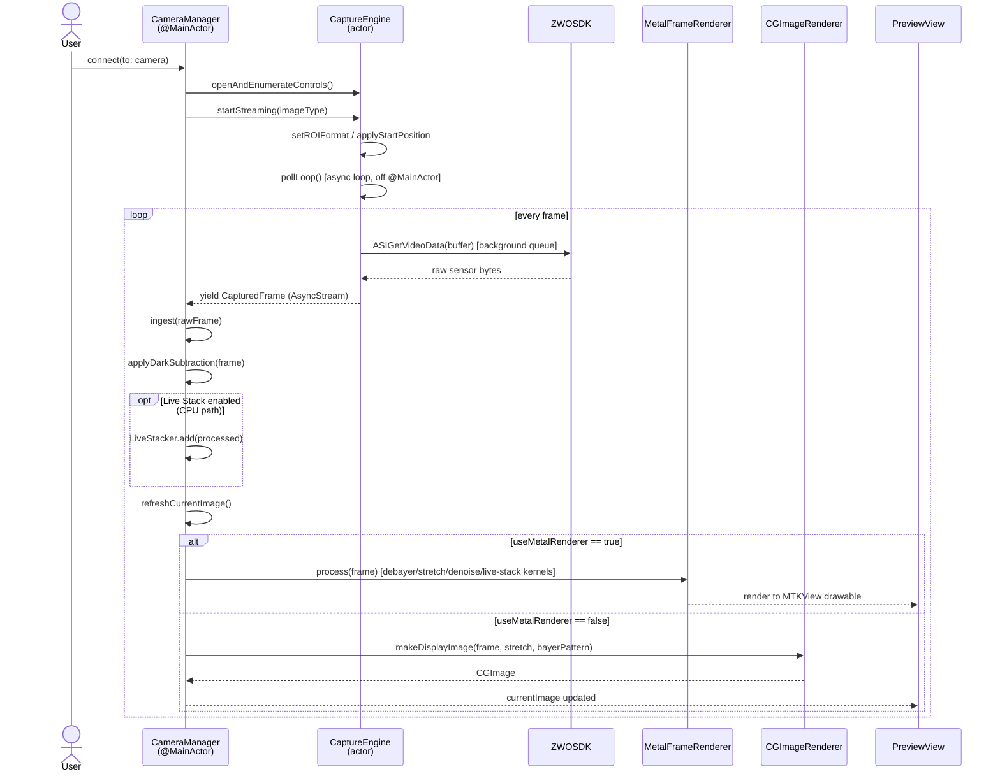
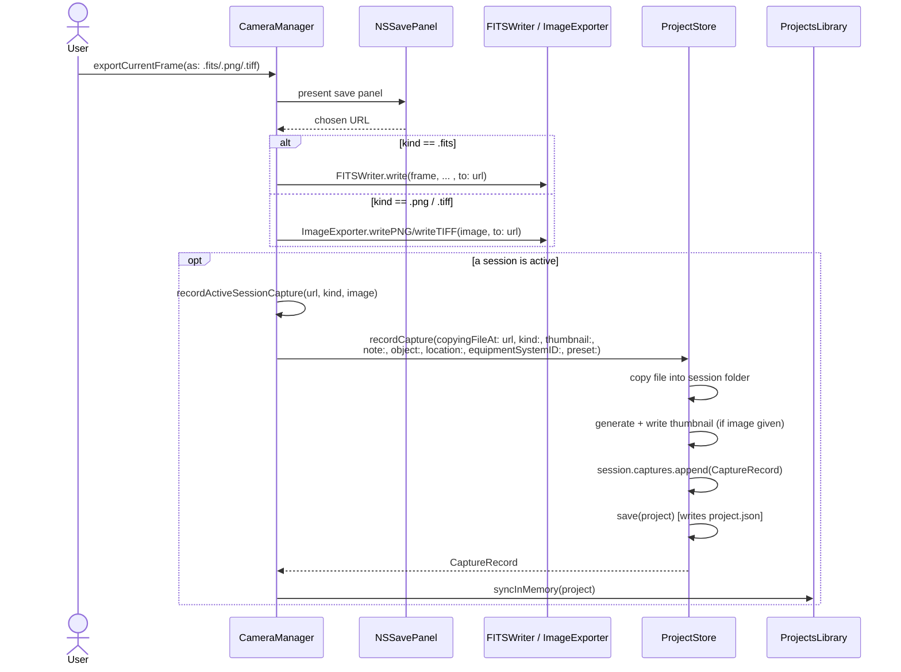
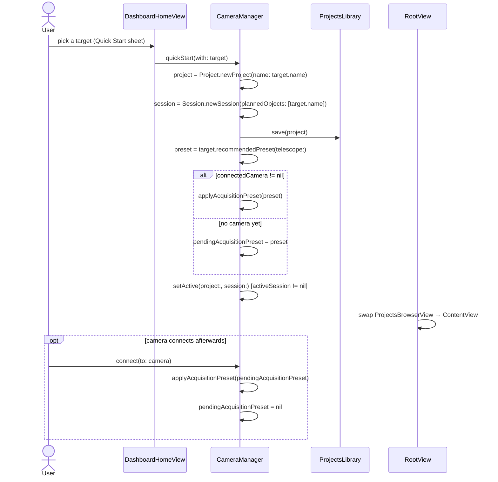

# Architecture

What's in each part of the codebase, folder by folder — plus a high-level block
diagram, the tech stack, and the primary sequence diagrams for the flows that
matter most. Diagrams are [Mermaid](https://mermaid.js.org/), which GitHub
renders natively in Markdown — no extra tooling needed to view them.

## High-level architecture

```mermaid
graph TB
    subgraph UI["SwiftUI Views (skyformac/Views/, Help/)"]
        RootView["RootView<br/>(single-window swap)"]
        Dashboard["DashboardHomeView<br/>+ ProjectsBrowserView<br/>(Home → Projects → Project → Session)"]
        ContentView["ContentView<br/>(live camera session)"]
        ControlsPanel["ControlsPanelView<br/>(Camera / Improve / Planetary / Deep Sky)"]
        Preview["PreviewView / MTKView"]
        Insights["InsightsView / SettingsView / EquipmentPage / RecallParametersView"]
    end

    subgraph VM["View model (skyformac/CameraManagement/)"]
        CameraManager["CameraManager<br/>(@Observable @MainActor)"]
        AppSettings["AppSettings<br/>(typed UserDefaults)"]
    end

    subgraph Capture["Capture (skyformac/Capture/)"]
        CaptureEngine["CaptureEngine (actor)<br/>ASIGetVideoData poll loop"]
        WebcamEngine["WebcamCaptureEngine<br/>(AVCaptureSession)"]
        LiveStacker["LiveStacker / LuckyImagingSession<br/>CalibrationLibrary"]
        AllSky["AllSkyMonitor / AllSkyAnalyzer"]
    end

    subgraph Bridge["Bridging (skyformac/Bridging/)"]
        ZWOSDK["ZWOSDK / ZWOError / ZWOCameraInfo"]
    end

    subgraph Vendor["Vendor/ZWO/"]
        Dylib["libASICamera2.dylib<br/>(vendored, universal binary)"]
    end

    subgraph Rendering["Rendering (skyformac/Rendering/)"]
        GPUPath["MetalFrameRenderer + Shaders.metal<br/>(debayer/stretch/denoise/sharpen/live-stack)"]
        CPUPath["CGImageRenderer + Debayer + HistogramComputer"]
        PixelMath["FrameArithmetic, SharpnessScorer, FITSWriter,<br/>ImageExporter, PolarAlignmentSolver, PlanetTracker, …"]
    end

    subgraph CatalogArea["Catalog (skyformac/Catalog/)"]
        WCS["WCSProjection / LiveWCSSolver"]
        CatalogRepo["CatalogRepository<br/>(SQLite, read-only)"]
    end

    subgraph ProjectsArea["Projects (skyformac/Projects/)"]
        ProjectsLibrary["ProjectsLibrary<br/>(@Observable in-memory list)"]
        ProjectStore["ProjectStore<br/>(filesystem persistence, JSON)"]
        InsightsData["InsightsData / ProjectSearch"]
        OllamaPlanner["OllamaPlanner"]
        EquipmentLibrary["EquipmentLibrary"]
    end

    subgraph ResourcesArea["Resources (bundled, read-only)"]
        SkyCatalog["SkyCatalog/*.json<br/>(Messier + bright stars)"]
        AstroSqlite["AstroCatalog/astro_catalog.sqlite"]
    end

    subgraph External["External systems"]
        Ollama["Local Ollama server<br/>(HTTP, localhost)"]
        FS["~/Documents/Skyformac Projects/<br/>(or a custom folder)"]
        CoreLocationSvc["Core Location"]
        ContinuityCamera["Continuity Camera / USB webcam"]
    end

    RootView --> Dashboard
    RootView --> ContentView
    ContentView --> ControlsPanel
    ContentView --> Preview
    Dashboard --> Insights
    Dashboard --> ProjectsLibrary

    ControlsPanel --> CameraManager
    Preview --> CameraManager
    Insights --> ProjectsLibrary
    Insights --> EquipmentLibrary

    CameraManager --> AppSettings
    CameraManager --> CaptureEngine
    CameraManager --> WebcamEngine
    CameraManager --> LiveStacker
    CameraManager --> AllSky
    CameraManager --> GPUPath
    CameraManager --> CPUPath
    CameraManager --> WCS
    CameraManager --> ProjectsLibrary
    CameraManager --> OllamaPlanner

    CaptureEngine --> ZWOSDK
    ZWOSDK --> Dylib

    WebcamEngine --> ContinuityCamera
    GPUPath --> PixelMath
    CPUPath --> PixelMath
    WCS --> CatalogRepo
    CatalogRepo --> AstroSqlite
    CameraManager -.-> SkyCatalog

    ProjectsLibrary --> ProjectStore
    ProjectsLibrary --> InsightsData
    ProjectStore --> FS
    OllamaPlanner --> Ollama
    CameraManager --> CoreLocationSvc
```

Everything under **Capture**, **Rendering**, **Catalog**, and **Projects** is
plain Swift with no SwiftUI/AppKit import — pure model/service code, directly
unit-testable without a camera, a window, or a filesystem fixture beyond a
temp directory. `CameraManager` is the one `@Observable`/`@MainActor` view
model gluing all of it to the UI layer; views themselves hold no business
logic beyond layout and local `@State`.

## Tech stack

| Layer | Technology |
|---|---|
| Language | Swift 6.0 (strict concurrency checking on) |
| UI | SwiftUI, with a handful of AppKit bridges (`NSViewRepresentable` for `MTKView`, `NSSavePanel`/`NSOpenPanel`, window tabbing control) |
| Charts | Swift **Charts** (`InsightsView`, `DashboardHomeView` — monthly activity and breakdown bar charts) |
| GPU compute | **Metal** + `Shaders.metal` (compute kernels for debayer, display stretch, denoise, wavelet sharpen, histogram, live-stack accumulation) |
| CPU fallback | `Accelerate`/`CoreGraphics`/`ImageIO` (`CGImageRenderer`, `Debayer`, `ImageEnhancer`) — same output, no GPU dependency |
| Camera hardware | Vendored **ZWO ASI Camera SDK** (`libASICamera2.dylib`, a proprietary C library, universal arm64+x86_64) behind a thin Swift bridge (`ZWOSDK`) — no raw C struct/pointer crosses out of `skyformac/Bridging/` |
| Webcam/iPhone capture | `AVFoundation` (`AVCaptureSession`) — Continuity Camera and any USB webcam, feeding the same `CapturedFrame` pipeline as a ZWO camera |
| Concurrency | Swift's actor model — `CaptureEngine` is an `actor` so every blocking ZWO SDK call is structurally isolated off `@MainActor`, compiler-enforced rather than just documented |
| Star/planet detection | Apple's **Vision** framework (on-device, no bundled third-party CV library) |
| Location | `CoreLocation`, behind an injectable `LocationRequesting` protocol so it's testable without real permissions |
| Local persistence | Plain JSON files, one folder per project/session (`ProjectStore`) — deliberately no database; `UserDefaults` for app preferences (`AppSettings`) |
| Bundled catalogs | `SQLite3` (C API) for the astronomical catalog HUD (`CatalogRepository`, read-only); JSON for the Messier/bright-star list (`SkyCatalog`) |
| AI planning | A **local Ollama** server over HTTP (`OllamaPlanner`, behind an `OllamaTransport` protocol) — no cloud dependency, prefers `qwen3:8b` if installed |
| File formats produced | FITS (`FITSWriter`, hand-written), PNG/TIFF (`ImageExporter`), SER video |
| Testing | **Swift Testing** (`skyformacTests`, 400+ unit tests) and **XCUITest** (`skyformacUITests`, real accessibility-tree UI tests) |
| CI | GitHub Actions (`.github/workflows/ci.yml`), `macos-15` runners, `make build`/`make test` on every push/PR |
| Build | Xcode 26+ / `xcodebuild`, wrapped by a `Makefile` |

## Folder-by-folder

- **`Vendor/ZWO/`** — vendored ZWO SDK: `include/ASICamera2.h` and a universal
  (arm64 + x86_64) `libASICamera2.dylib`, `lipo`'d together from the official
  SDK's `mac_arm64` and `mac` builds (`ASI_Camera_SDK/ASI_linux_mac_SDK_V1.41/lib/`)
  and ad-hoc re-signed. The dylib is linked and embedded into the app bundle
  (`Contents/Frameworks/`) via a Copy Files build phase.
- **`skyformac/Bridging/`** — the C-to-Swift bridge (`ZWOSDK`, `ZWOError`,
  `ZWOCameraInfo`, `ZWOControlCaps`). No raw C struct or pointer crosses out of
  this layer.
- **`skyformac/Capture/`**:
  - `CaptureEngine` — an `actor` owning the `ASIGetVideoData` poll loop for a
    real ZWO camera, off the main thread by construction, and `FrameBuffer`
    (the preallocated poll buffer).
  - `WebcamCaptureEngine` — the Continuity Camera/USB-webcam capture path
    (`AVCaptureSession`), feeding the same `CapturedFrame` pipeline as a ZWO
    camera. See [design-notes.md](design-notes.md) for the frame-backpressure
    design this needed.
  - `AllSkyMonitor` + `AllSkyAnalyzer` — the secondary webcam/Continuity Camera
    safety monitor (picture-in-picture), independent of the main ZWO pipeline;
    `AllSkyAnalyzer` is the pure, unit-tested brightness/motion-alert logic
    behind it.
  - `LiveStacker` (CPU running-average accumulator), `LuckyImagingSession`
    (burst capture + sharpness-ranked stacking), `CalibrationLibrary`
    (multiple named dark *and* flat frames), `SkyCatalog` (the bundled
    Messier + bright-star data `StarPatternRecognizer` matches against).
- **`skyformac/CameraManagement/`** — `CameraManager`, the `@Observable`
  `@MainActor` view model that owns camera discovery/lifecycle, the dynamic
  control set, the capture pipeline entry point (`ingest`), and the Projects
  feature's own entry points (`quickStart(with:)`, `recallParameters(_:)`,
  `recordActiveSessionCapture`). `AppSettings.swift` is the typed
  `UserDefaults` wrapper for preferences that survive a relaunch (render
  path, enhancement toggles, which overlays are on, the Projects folder
  location) — session state (calibration frames, live-stack accumulation,
  in-progress polar alignment) deliberately isn't persisted, it always starts
  fresh.
- **`skyformac/Rendering/`** — both render paths:
  - CPU: `CGImageRenderer` + `Debayer` + `HistogramComputer`.
  - GPU: `MetalFrameRenderer` + `Shaders.metal` (RAW8/RAW16 debayer/stretch,
    RGB24 stretch for webcam sources, plus the histogram/denoise/wavelet-
    sharpen/live-stack compute kernels).
  - `DisplayStretch` is the shared black/white-point model both paths use.
  - `FrameArithmetic` (subtract/average), `SharpnessScorer` +
    `GPUSharpnessScorer` (Laplacian-variance, CPU and GPU), `FITSWriter`, and
    `ImageExporter` (PNG/TIFF) — pure, directly-testable pixel/byte math with
    no camera dependency.
  - `ExposureOptimizer` (sub-exposure length calculator), `PlanetDetector` +
    `PlanetTracker` + `FrameCropper` (planetary auto-center/crop),
    `PolarAlignmentSolver` (rotation-center geometry), `HFDCalculator` +
    `FocusTracker` (focus-quality tracking), `StarDetector` +
    `StarPatternRecognizer` (star detection and catalog identification),
    `ImageEnhancer` (CPU fallback for the Metal denoise/wavelet-sharpen
    kernels, off-`@MainActor` and throttled — see design-notes.md),
    `DiskSpaceChecker` (continuous-recording disk-space guardrail).
- **`skyformac/Catalog/`** — the on-screen catalog overlay (see
  `specs/skyformac_Catalog_HUD_Spec.md`): `WCSProjection` (`WCSFrame`, the
  gnomonic pixel<->sky projection), `CatalogRepository` (read-only SQLite
  access to the bundled astronomical catalog), and `LiveWCSSolver` (fits a
  `WCSFrame` from real star correspondences — see design-notes.md).
- **`skyformac/Projects/`** — the Projects feature's model and services,
  independent of any UI: `ObservationModels.swift` (`Project`, `Session`,
  `GeoLocation`, `Annotation`, `CaptureRecord` — all `Codable`, with a
  `folderName` computed once at creation and never recomputed from a later
  rename), `ProjectStore` (filesystem persistence — one folder per
  project/session, one `project.json` per project, no database),
  `ProjectsLibrary` (the `@Observable` in-memory list the browser UI reads,
  the thing that makes an unnamed project's edits never touch disk),
  `ThumbnailGenerator` (`CGContext`/`CGImageDestination` JPEG downscaling,
  no third-party imaging library), `CoreLocationProvider` (GPS behind an
  injectable `LocationRequesting` protocol so it's testable without real
  Core Location permissions), `ProjectSearch` (free-text + date-range +
  tag/object/equipment filtering), `InsightsData` (a pure, clock-injected
  aggregator over every capture, feeding the Insights page and Dashboard),
  `EquipmentModels.swift`/`EquipmentLibrary` (named equipment systems, one
  JSON file per system under a configurable Equipment folder — the same
  one-folder-per-item philosophy `ProjectStore` uses, with a one-time
  migration off the older `AppSettings`/`UserDefaults`-backed storage),
  `SkyAtlasLookup` (resolves a session's free-text observed object to a
  fixed RA/Dec against the bundled `SkyCatalog`, for the Atlas view),
  `ProjectArchive` (zips/unzips a whole project folder via `/usr/bin/ditto`
  for "Save As Project…"/"Load Project…," always assigning a fresh
  id/folderName on import), `AstronomyKnowledgeBase` (a small,
  user-editable folder of `.md` reference files — season a Messier object
  is best in, planet visibility mechanics — folded into every AI request
  to ground a small local model in real facts; explicitly not a
  substitute for real position calculation, which this app doesn't do),
  and `OllamaPlanner` (talks to a local Ollama server behind an
  `OllamaTransport` protocol for the same reason; proposes session/project
  plans, plain-text descriptions, next-objects-to-observe, a full
  next-session plan driven by a user-editable "skill" text, and the
  sidebar AI panel's own classify-then-propose replies).
- **`skyformac/Resources/`**:
  - `SkyCatalog/` — `messier.json` (110 Messier objects, extracted from
    Stellarium's real DSO catalog at `stellarium/nebulae/default/catalog.txt`)
    and `bright_stars.json` (a small hand-curated bright-star list, public
    J2000 coordinates) — what `SkyCatalog.swift` loads.
  - `AstroCatalog/astro_catalog.sqlite` — the bundled catalog
    `CatalogRepository` queries; rebuilt by `scripts/build_astro_catalog.py`.
- **`skyformac/App/`** — `SkyformacApp` (the `@main` entry point, one
  `WindowGroup` with automatic window tabbing explicitly disabled) and
  `SkyformacCommands` (menu bar commands: export, project file Save
  As/Load, camera connect/rescan, Settings, the **Project** menu (including
  Show All Projects), a dedicated **Equipment** menu (View/Add New),
  toolbar toggles, all with keyboard shortcuts — the **Camera** and
  **Sidebar Tab** menus only appear at all while a camera session is
  running). `AppLog` is the app-wide in-memory log (`skyformac → Show
  Log…`) that most error paths feed automatically via
  `CameraManager.lastErrorMessage`'s `didSet`.
- **`skyformac/Help/`** — `HelpContent.swift`: plain structured content
  (topics/sections) rendered with real SwiftUI typography by `HelpView`
  (`skyformac/Views/`), not a bundled webpage; supports full-text search
  across every section.
- **`skyformac/Views/`** — SwiftUI. `RootView` is `SkyformacApp`'s actual
  `WindowGroup` content — it swaps between `ProjectsBrowserView` and
  `ContentView` in the same window based on `CameraManager.activeSession`,
  never a second `Scene` (per `SkyformacApp`'s single-window design).
  `ControlsPanelView` has a sidebar-tab picker (Camera Controls / Improve /
  Planetary / Deep Sky) filtering which of its tool sections show.
  `ProjectsBrowserView` (a `NavigationStack` drill-down) roots at
  `DashboardHomeView` — an orientation dashboard (resume the last session,
  common-task shortcuts, recent projects, an activity chart, AI-computed
  "Ideas for Next Time" and a "Suggested Session" card, both falling back
  gracefully with no Ollama server) — and pushes **Projects** (thumbnail
  grid, table, or the RA/Dec **Atlas** view — `AtlasView` — of every
  session across every project) → **Project Detail** (`ProjectDetailPane`)
  → **Session** (`SessionDetailPane`, history/timeline) → **Capture**
  (`CaptureDetailPage`), plus side routes for **Equipment** (`EquipmentPage`),
  **Insights** (`InsightsView`), Archived, and Recently Deleted. Projects,
  sessions, and captures can be rated (1-5 stars) and (projects/sessions)
  marked as favorites, which sort to the top of their lists and feed the AI
  panel's own context. `AssistantChatPanel`/`AssistantChatPanelController`
  are the sidebar **AI** panel — dockable, resizable, detachable into a
  floating `NSPanel`, forced detached while a camera session is running.
  `RecallParametersView` and `SettingsView` are `.sheet`s attached to
  `RootView` itself so they work from either the browser or the live
  camera view. All built on `skyformac/Projects/`'s model layer.
- **`skyformacTests/`** — unit tests (Swift Testing) covering every piece of
  pixel/geometry/signal-processing math in the app: debayer, the stretch LUT,
  `ASI_ERROR_CODE` mapping, frame arithmetic, live-stack averaging,
  lucky-imaging selection, sharpness scoring (CPU and GPU), FITS/PNG/TIFF I/O,
  the sky catalog, star-pattern recognition and correspondence resolution,
  live-WCS solving, frame cropping, planet detection/tracking, polar-alignment
  rotation-center solving, HFD/focus tracking, the exposure-length optimizer,
  flat-field correction, the calibration library, the CPU image enhancer, the
  all-sky brightness/motion analyzer, disk-space checking, and the Projects
  feature (folder persistence and rename-safety, thumbnail generation,
  active-session capture filing with its full parameter snapshot, GPS/manual
  location, search/filtering, equipment systems, Insights aggregation, and
  Ollama plan parsing against a fake transport).
- **`skyformacUITests/`** — XCUITest UI-level tests driving the actual SwiftUI
  view tree (launch into the Dashboard, Quick Start into the camera view, the
  toolbar renderer toggle, opening Settings/Insights/Projects) — these
  exercise the real accessibility-tree/view hierarchy, not just the
  underlying logic.

## Primary sequence diagrams

### Camera connect and live frame pipeline

The path from pressing **Connect** to a frame actually appearing on screen —
the poll loop runs on `CaptureEngine`'s own actor so a blocking SDK call can
never freeze the UI, and the render path branches on the GPU/CPU toggle.

### Capture export and Project/Session recording

Exporting a frame (or finishing an SER recording) both writes the actual
file and — if a session is active — files a detailed record of the action
into that session's timeline, snapshotting the object, location, equipment,
and every acquisition parameter in effect at that moment.

### Quick Start: from a curated target to a running session

Skips manually creating a project/session — the recommended preset applies
right away if a camera's already connected, or is held pending until one is,
the same mechanism **Recall Parameters** reuses for reapplying a past
action's settings.

